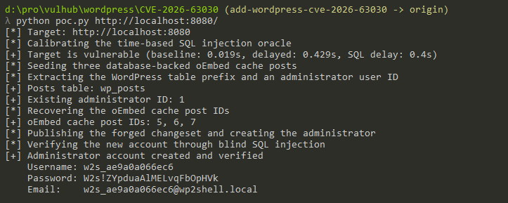
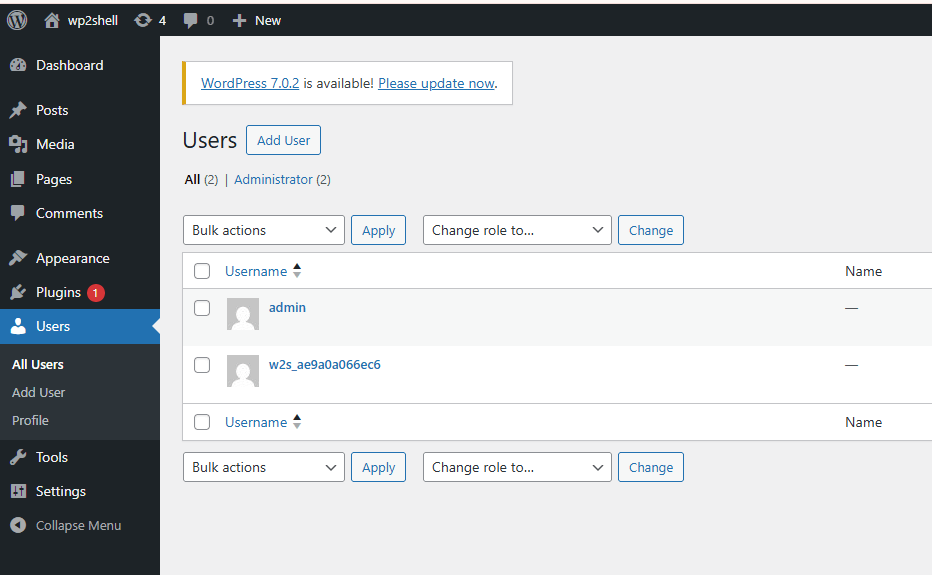

# WordPress Pre-Auth RCE via REST API Batch Route Confusion and SQL Injection (wp2shell, CVE-2026-63030 / CVE-2026-60137)

[中文版本(Chinese version)](README.zh-cn.md)

[WordPress](https://wordpress.org/) is the world's most widely used open source content management system.

wp2shell is a pre-authentication administrator-creation chain in WordPress core that combines two vulnerabilities. CVE-2026-63030 is a route confusion flaw in `WP_REST_Server::serve_batch_request_v1()`. When a batch sub-request cannot be parsed, its error is appended to the `$validation` array without a corresponding entry in the `$matches` array. The arrays then become misaligned, allowing a later sub-request to be dispatched using the route and handler matched for a different request.

CVE-2026-60137 is a SQL injection vulnerability in `WP_Query`. The `author__not_in` parameter is converted to integers only when supplied as an array; a string value can consequently be interpolated into the `post_author NOT IN (...)` clause. By nesting one REST API batch inside another, an unauthenticated attacker can submit `GET /wp/v2/categories?author_exclude=<SQL>`. The categories endpoint does not register `author_exclude`, so the value survives validation, while the route confusion causes the request to run under the posts `get_items()` handler. That handler maps `author_exclude` to the vulnerable `author__not_in` query variable, providing a pre-authentication blind SQL injection primitive.

The exploit used in this environment upgrades the SQL injection to unauthorized administrator creation through WordPress post-object caching and the Customizer changeset workflow. It first makes WordPress create three real `oembed_cache` posts and retrieves their database IDs through blind SQL injection. An `oembed_cache` entry is a hidden post type stored in the posts table, not an external page cache. The exploit then uses `UNION SELECT` to return a forged graph of `wp_posts` rows. WordPress treats these rows as `WP_Post` objects and caches them, while the forged objects reuse the real `oembed_cache` IDs and masquerade as a scheduled `customize_changeset`, a `request`, and related posts. Their parent-child relationships and embedded content trigger re-entrant processing that publishes the forged changeset during the batch request. Because the changeset contains an administrator's `user_id`, WordPress temporarily calls `wp_set_current_user()` with that ID while saving the setting. Two user-creation requests in the same batch therefore pass their capability checks and create a new administrator.

The upstream advisory classifies the complete impact as remote code execution because an administrator can commonly install executable plugins. This proof-of-concept deliberately stops after creating and verifying the administrator account. Plugin installation and command execution depend on deployment-specific settings such as plugin policy, filesystem permissions, and security hardening, none of which are required to demonstrate the underlying vulnerability chain.

The version ranges for the two vulnerabilities are different. CVE-2026-63030 affects WordPress 6.9.0 through 6.9.4 and 7.0.0 through 7.0.1, and is fixed in 6.9.5 and 7.0.2. CVE-2026-60137 additionally affects WordPress 6.8.0 through 6.8.5, and is fixed in 6.8.6, 6.9.5, and 7.0.2. WordPress 6.8 is therefore vulnerable to the SQL injection alone, but not to the combined wp2shell chain described here, which requires both vulnerabilities.

References:

- <https://github.com/WordPress/wordpress-develop/security/advisories/GHSA-ff9f-jf42-662q>
- <https://github.com/WordPress/wordpress-develop/security/advisories/GHSA-fpp7-x2x2-2mjf>
- <https://wordpress.org/news/2026/07/wordpress-7-0-2-release/>
- <https://developer.wordpress.org/cli/commands/embed-2/cache/find/>
- <https://bugbunny.ai/blog/wordpress-7-0-2-rce-deep-dive#three-fixes-for-three-broken-assumptions>
- <https://github.com/sergiointel/wp2shell-poc>

## Environment Setup

Execute the following command to start WordPress 6.9.4:

```
docker compose up -d
```

The environment installs WordPress automatically on first boot, so no setup wizard is needed. Because the MySQL container needs a little time to initialize, please wait a moment after the containers start. Once it is ready, WordPress is available at `http://your-ip:8080` with an administrator account `admin` / `admin` and the default `Hello world!` post that the exploit relies on. The exploit itself is unauthenticated and does not need these credentials.

## Vulnerability Reproduction

You can reproduce the whole exploit chain with [poc.py](poc.py).

Before creating any account, confirm the underlying SQL injection with `--check`. This mode sends the nested batch request whose inner `author_exclude` parameter carries a time-based payload, calibrates the response delay, and stops without touching the database:

```
python3 poc.py http://your-ip:8080 --check
```

When the target is vulnerable, the script calibrates the timing oracle and reports the baseline and delayed timings. This alone proves the pre-authentication blind SQL injection:

```
[*] Target: http://your-ip:8080
[*] Calibrating the time-based SQL injection oracle
[+] Target is vulnerable (baseline: 0.412s, delayed: 0.821s, SQL delay: 0.4s)
[*] Check-only mode selected; no administrator account was created
```

Now run the script without `--check` to execute the full administrator-creation chain:

```
python3 poc.py http://your-ip:8080
```

The script prints its progress at each stage of the chain described above: it seeds three real `oembed_cache` posts, recovers the table prefix, an existing administrator's user ID, and the cache-post IDs through blind SQL injection, then publishes the forged changeset that lets the two `POST /wp/v2/users` sub-requests create a new administrator. Finally it reuses the same blind injection to confirm that the account exists with the `administrator` role and prints its credentials:

```
[*] Target: http://your-ip:8080
[*] Calibrating the time-based SQL injection oracle
[+] Target is vulnerable (baseline: 0.412s, delayed: 0.821s, SQL delay: 0.4s)
[*] Seeding three database-backed oEmbed cache posts
[*] Extracting the WordPress table prefix and an administrator user ID
[+] Posts table: wp_posts
[+] Existing administrator ID: 1
[*] Recovering the oEmbed cache post IDs
[+] oEmbed cache post IDs: 4, 5, 6
[*] Publishing the forged changeset and creating the administrator
[*] Verifying the new account through blind SQL injection
[+] Administrator account created and verified
    Username: w2s_<random>
    Password: W2s!<random>
    Email:    w2s_<random>@wp2shell.local
```

This creates a new administrator account without authentication, regardless of login restrictions, plugin policy, or filesystem permissions:



To confirm the result in the browser, log in to `http://your-ip:8080/wp-admin/` with the `w2s_<random>` username and password printed by the proof-of-concept. A successful login is itself proof that the exploit worked, and the Users page then lists the attacker-created administrator alongside the original `admin` account:



With administrator access, an attacker can further obtain a webshell and execute arbitrary commands on the server, for example by uploading a malicious plugin or theme.
